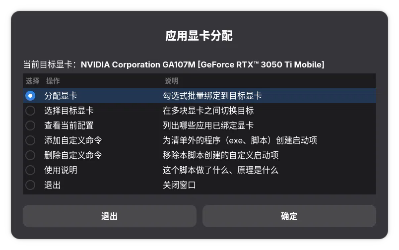
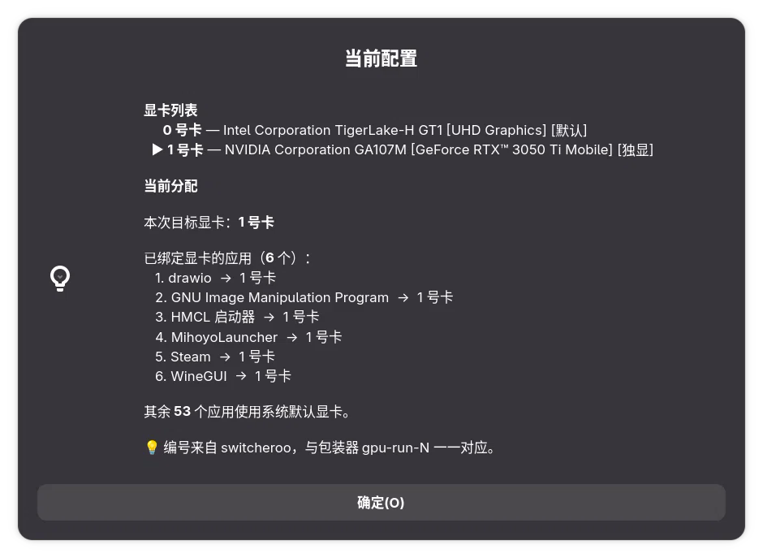
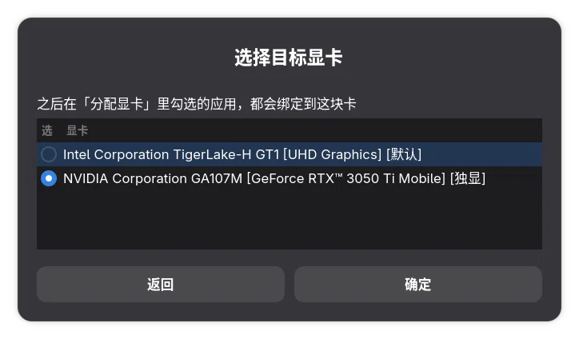

请优先使用另一个项目 gpu-pref-manager！！！
请优先使用另一个项目 gpu-pref-manager！！！
请优先使用另一个项目 gpu-pref-manager！！！
重要事情说三遍
# set-app-gpu-gui

给 Linux 混合显卡笔记本用的**按应用分配显卡**工具 —— 图形界面 + 命令行。

还在为每个游戏右键「使用独立显卡启动」吗？这个脚本让你**一次配置、永久生效**。


## 截图

主菜单与当前配置：

| 应用显卡分配 | 查看当前配置 |
|---|---|
|  |  |

多显卡时可切换「目标显卡」，之后勾选的应用都绑定到它：



## 特性

- **自动识别全部显卡** —— 不限品牌（Intel / AMD / NVIDIA）、不限数量，信息来自 `switcheroo-control`，缺失时回退 `/sys/class/drm`
- **勾选式批量分配** —— 不用一个个右键
- **不碰系统文件** —— 只写 `~/.local/share/applications/`，随时可撤销
- **通用包装器机制** —— 每块卡一个 `gpu-run-N` 命令，与品牌无关
- **附带命令行模式** —— 可在脚本里调用，也方便排障
- **处理边界情况** —— 子目录 desktop 文件、旧格式配置、NoDisplay 项

## 依赖

| 依赖 | 必需性 | 说明 |
|---|---|---|
| `bash` ≥ 4.0 | **必需** | 用到 globstar、关联数组 |
| `zenity` | **必需**（图形界面） | GUI 对话框 |
| `switcheroo-control` | 推荐 | 识别显卡；缺失时自动回退 `/sys/class/drm` |
| `desktop-file-utils` | 推荐 | 提供 `update-desktop-database` |

安装依赖（按发行版选择）：

```bash
# Fedora
sudo dnf install zenity switcheroo-control desktop-file-utils

# Debian / Ubuntu
sudo apt install zenity switcheroo-control desktop-file-utils

# Arch
sudo pacman -S zenity switcheroo-control desktop-file-utils
```

## 安装

### 方式一：安装脚本（推荐）

```bash
tar xzf set-app-gpu-gui-1.0.0.tar.gz
cd set-app-gpu-gui
./install.sh
```

装到别的位置：

```bash
./install.sh --prefix /usr/local/bin
```

脚本会检查 `zenity`、提示 PATH 配置，并给出后续用法。

### 方式二：手动复制

```bash
install -m 755 set-app-gpu-gui.sh ~/.local/bin/set-app-gpu-gui
```

> 如果 `~/.local/bin` 不在 PATH 中，脚本会自动改用绝对路径写进 `.desktop`，
> 但建议还是把它加进 PATH。

### 方式三：不安装直接跑

```bash
bash set-app-gpu-gui.sh
```

## 使用

### 图形界面

```bash
set-app-gpu-gui
```

主菜单：

| 菜单项 | 作用 |
|---|---|
| **分配显卡** | 勾选式批量绑定到「目标显卡」 |
| **选择目标显卡** | 多块卡时切换目标 |
| **查看当前配置** | 列出显卡编号对照表与已绑定应用 |
| **添加自定义命令** | 为清单外的程序（exe、脚本）创建启动项 |
| **删除自定义命令** | 移除本脚本创建的启动项 |

### 命令行

```bash
set-app-gpu-gui --gpus      # 列出识别到的显卡
set-app-gpu-gui --list      # 列出显卡 + 已绑定应用
set-app-gpu-gui --check     # 检查依赖与环境
set-app-gpu-gui --version
set-app-gpu-gui --help
```

`--check` 示例输出：

```
环境检查
  bash 版本 : 5.3.9(1)-release
  脚本版本  : set-app-gpu-gui v1.0.0

  依赖:
    zenity                   ✅ /usr/bin/zenity
    switcherooctl            ✅ /usr/bin/switcherooctl
    ...

  目录:
    用户 desktop   ✅ /home/user/.local/share/applications
    包装器目录     ✅ /home/user/.local/bin
    PATH           ✅ 已包含包装器目录

  包装器:
    gpu-run-0                    ✅
    gpu-run-1                    ✅
```

## 工作原理

### 1. 识别显卡

优先问 `switcheroo-control`，它会给出每块卡的名称和**该卡对应的环境变量**：

```
Device: 0
  Name:        Intel Corporation TigerLake-H GT1 [UHD Graphics]
  Default:     yes
  Discrete:    no
  Environment: DRI_PRIME=pci-0000_00_02_0 VK_LOADER_DRIVERS_SELECT=*intel*

Device: 1
  Name:        NVIDIA Corporation GA107M [GeForce RTX 3050 Ti Mobile]
  Default:     no
  Discrete:    yes
  Environment: __GLX_VENDOR_LIBRARY_NAME=nvidia __NV_PRIME_RENDER_OFFLOAD=1 ...
```

### 2. 生成包装器

为每块卡生成 `~/.local/bin/gpu-run-N`，里面固化好该卡的环境变量：

```bash
#!/usr/bin/env bash
# 用「NVIDIA Corporation GA107M [GeForce RTX 3050 Ti Mobile]」运行指定程序
export __GLX_VENDOR_LIBRARY_NAME='nvidia'
export __NV_PRIME_RENDER_OFFLOAD='1'
export __VK_LAYER_NV_optimus='NVIDIA_only'
export VK_LOADER_DRIVERS_SELECT='*nvidia*'

exec "$@"
```

### 3. 改写 Exec

把桌面文件的 `Exec=` 加上包装器前缀：

```ini
Exec=gpu-run-1 /usr/bin/steam %U
```

恢复默认就是去掉前缀。**与显卡品牌完全无关。**

> 旧版脚本用的 `prime-run` 前缀也能被识别，重新勾选时会自动规范化。

## 相关项目

如果场景是**双显卡笔记本 + 从启动器启动**，推荐用更轻量的 **gpu-pref-manager**：
它只写一行标准键 `PrefersNonDefaultGPU=true`，不生成任何包装器。

本工具仍然适用于：

- 三块以上显卡，需要**指定具体哪一块**
- **双击文件关联**启动也要 offload（GLib 尚未实现标准键）
- 桌面环境不支持 `PrefersNonDefaultGPU`（如 GNOME < 50）

若两者放在同一目录，见 `../gpu-pref-manager/`。

## 兼容性

### 桌面环境

脚本**不依赖任何特定桌面环境**。它用到的都是跨桌面的标准：

| 技术 | 依据 |
|---|---|
| `.desktop` 的 `Exec=` 前缀 | freedesktop Desktop Entry Specification |
| `~/.local/share/applications/` | XDG Base Directory Specification |
| `switcheroo-control` | 独立的 freedesktop D-Bus 服务，数据源为内核 DRM + udev |
| `__NV_PRIME_RENDER_OFFLOAD` / `DRI_PRIME` | 驱动层机制 |

**支持的环境**：GNOME，KDE Plasma、XFCE、Cinnamon 等遵循 freedesktop 标准的桌面。

> ### KDE 用户注意
>
> KDE 默认**不安装** `zenity`（它用 `kdialog`），需要手动补上：
>
> ```bash
> sudo dnf install zenity switcheroo-control    # Fedora KDE
> sudo pacman -S zenity switcheroo-control      # Arch
> sudo apt install zenity switcheroo-control    # Debian / Ubuntu
> ```
>
> - 缺 `zenity` → 图形界面无法启动
> - 缺 `switcheroo-control` → 自动回退 `/sys/class/drm`，按 vendor ID 推断环境变量，功能正常但精度略低

### 其他

- **仅限 Linux**（依赖 `/sys/class/drm`）
- **显示协议**：Wayland 与 X11 均可
- **显卡**：Intel / AMD / NVIDIA 混合或单卡；单卡时脚本会提示无需分配
- **已知限制**：Flatpak 应用不在覆盖范围（沙箱机制不同，需用 `flatpak override --env=` 单独处理）
- **子目录中的 desktop 文件**：GNOME 会扫描并拼成 `子目录名-文件名` 的 ID；其他桌面环境理论上一致，但未验证

## 常见问题

**Q: 勾选后没生效？**
重启对应应用。已经运行的进程不会受影响。

**Q: WineGUI / Lutris 等生成的启动项被覆盖回去了？**
这类工具会重新生成 `.desktop`。重新勾选一次即可。

## 卸载

```bash
# 1. 把所有应用恢复默认（在图形界面里全部取消勾选），或手动去掉 Exec 前缀
# 2. 删除包装器与脚本
rm -f ~/.local/bin/gpu-run-* ~/.local/bin/set-app-gpu-gui
# 3. 删除自定义启动项（用「删除自定义命令」，或手动）
```

## 许可

MIT
